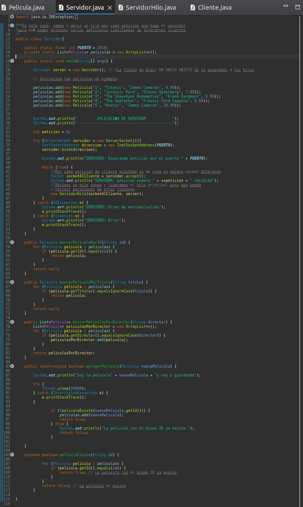
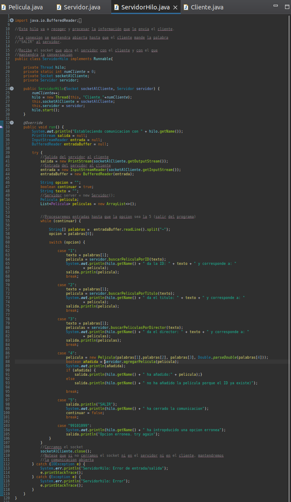
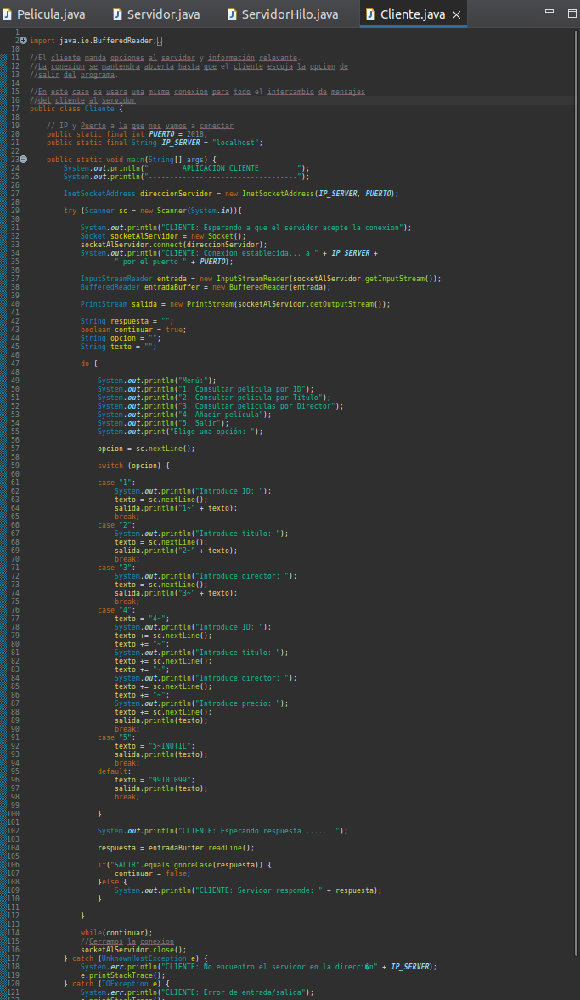
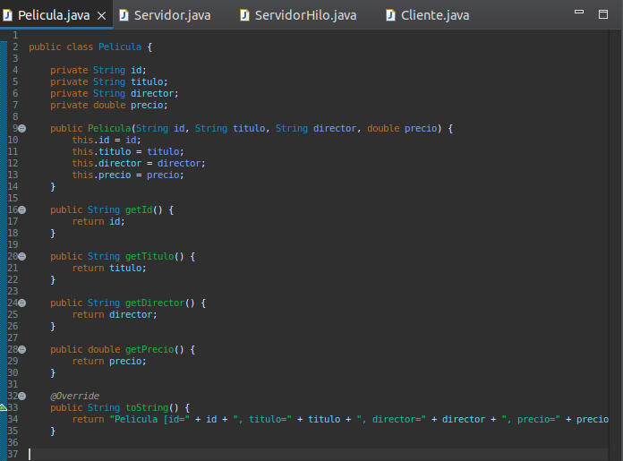
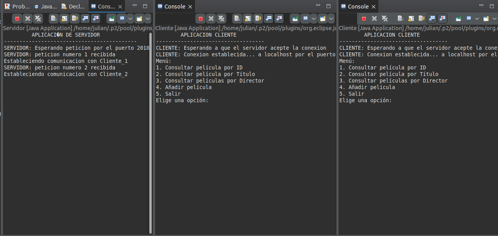
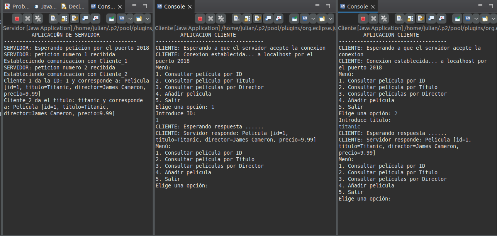
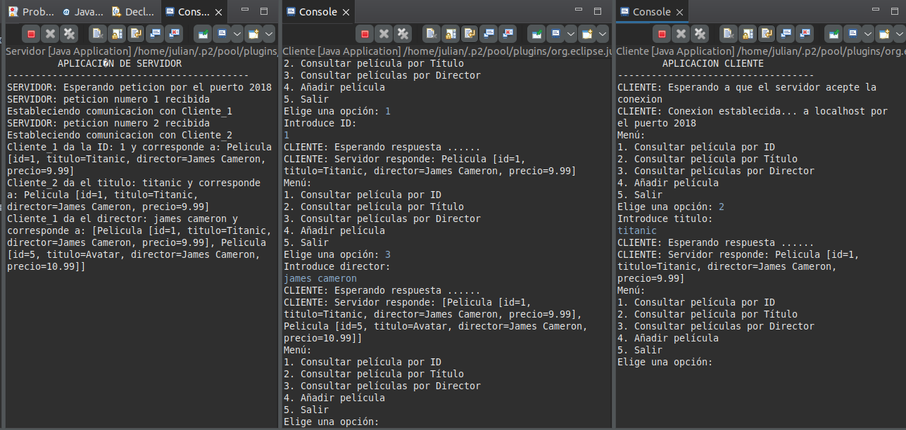

# AE-1. Hilos Y Sockets
Actividad 1 de Programacion de Servicios y Procesos. Aprender a trabajar de manera practica con los hilos y los sockets de java

Esta es la práctica 1 de Programación de Servicios y procesos del grupo 4 en el que sólo ha trabajado Julińa Méndez.

Link a github:

https://github.com/JulianMendezEdix/ae1_HilosYSockets

saludos!

---
## CLASES

### Servidor

### ServidorHilo

### Cliente

### Pelicula

## RESULTADOS

### Dos clientes en el Servidor

### Opciones 1 y 2 del menú

### Opcion 3 del menú

### Opcion 4 del menú (SINCRO)

<video width="320" height="240" controls>
    <source src="vid/vid1.mp4" type="video/mp4">
    Your browser does not support the video tag.
</video>

